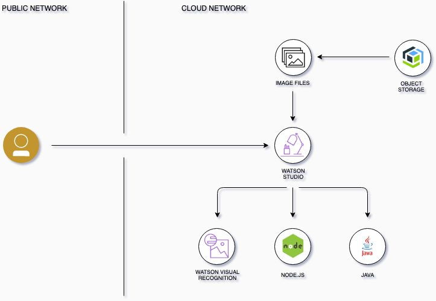

# Workshop sobre API Connect - Aprenda a gestionar el ciclo de vida de sus APIs

<p align="center">
  
</p>

## Flujo


## Resumen


## Descripción


## ¿Qué tiene el repositorio?
- ClimbingWeather-API.yaml
- Imagenes
- README.md

## Prerrequisitos
* Registrarse en IBM Cloud: [https://cloud.ibm.com/registration](https://cloud.ibm.com/registration)
* Instalar Git
  - [Windows](https://gitforwindows.org/)
  - Linux
    ```
    $ sudo apt update 
    $ sudo apt install git
    $ git --version
    ```
  - [MacOS](https://git-scm.com/download/mac)

* Clonar el repositorio
  ```
  $ git clone https://github.com/IBMInnovationLabUY/api-connect-code-day
  ```

* Instalar [Node.js](https://nodejs.org/es/download/)

## Arquitectura

<p align="center">
  
</p>

## 
