# Workshop sobre API Connect - Aprenda a gestionar el ciclo de vida de sus APIs

<p align="center">
  
</p>

## Flujo
* Crear una instancia del servicio API Connect
* Configuraciones iniciales(NO SE SI VA)
* Publicar una API
* Realizar llamadas a la API publicada
* Analizar el uso de la API
* Agregar seguridad a la API
* Introducción al Developer Portal 

## Resumen

IBM API Connect es una solución líder en el mercado de gestión de API que permite la creación automatizada de API, descubrimiento de activos, autoservicio para desarrolladores con administración y seguridad incorporada. Esta herramienta le facilita la labor a los desarrolladores para crear, desplegar, administrar, asegurar y monetizar sus APIs.

## Descripción

En este hands-on aprenderemos a utilizar el servicio API Connect con el que podremos publicar una API, agregándole aspectos de seguridad para que no cualquier persona pueda consumirla. Luego, utilizaremos la API de forma local mediante la aplicación Postman. Una vez que tengamos algunas llamadas realizadas, pasaremos a analizar el uso de la API mediante un panel personalizable. Por último, entenderemos cómo utilizar el Developer Portal y cúales son sus beneficios. 

## ¿Qué tiene el repositorio?
- ClimbingWeather-API.yaml
- Imagenes
- README.md

## Prerrequisitos
* Registrarse en IBM Cloud: [https://ibm.biz/Bd26aa](https://ibm.biz/Bd26aa)
* Instalar Git
  - [Windows](https://gitforwindows.org/)
  - Linux
    ```
    $ sudo apt update 
    $ sudo apt install git
    $ git --version
    ```
  - [MacOS](https://git-scm.com/download/mac)

* Clonar el repositorio
  ```
  $ git clone https://github.com/IBMInnovationLabUY/api-connect-code-day
  ```
* Instalar [Postman](https://www.getpostman.com/downloads/)

## Crear una instancia del servicio API Connect

Para crear la instancia del servicio, entramos a nuestra cuenta de IBM Cloud y seleccionamos la pestaña **Catalog**.

<p align="center">
  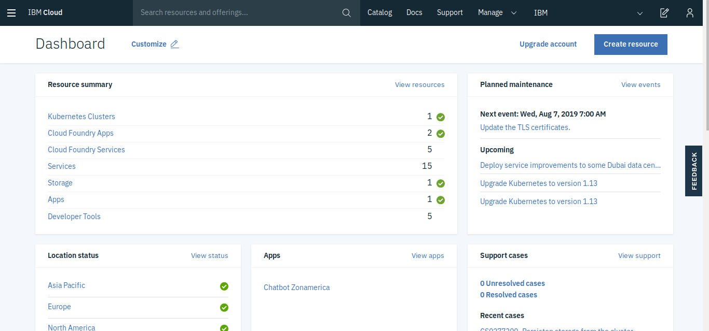
</p>

Presionamos a la opción **Integration** y seleccionamos el servicio **API Connect**.

<p align="center">
  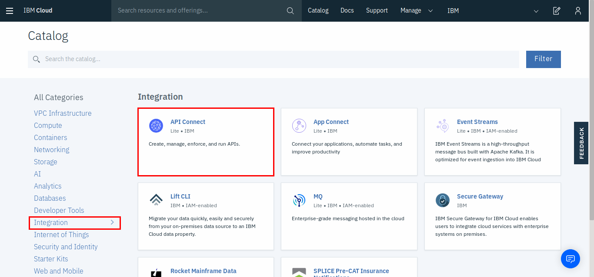
</p>

Hay que ingresar un nombre para la instancia que vamos a crear. En este caso, ponemos _API Connect-code-day_ y presionamos el botón **Create**.

<p align="center">
  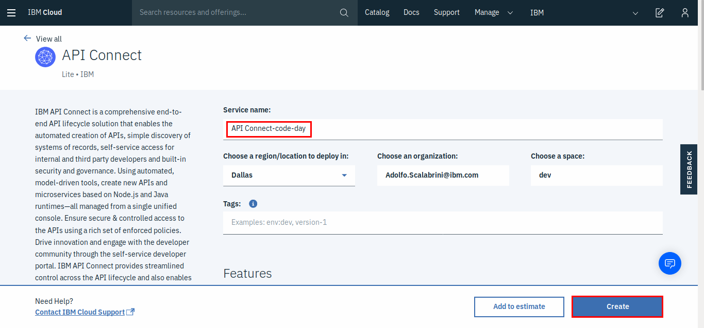
</p>

Luego, se abre la interfaz del servicio API Connect y podremos comenzar a trabajar en el mismo.

<p align="center">
  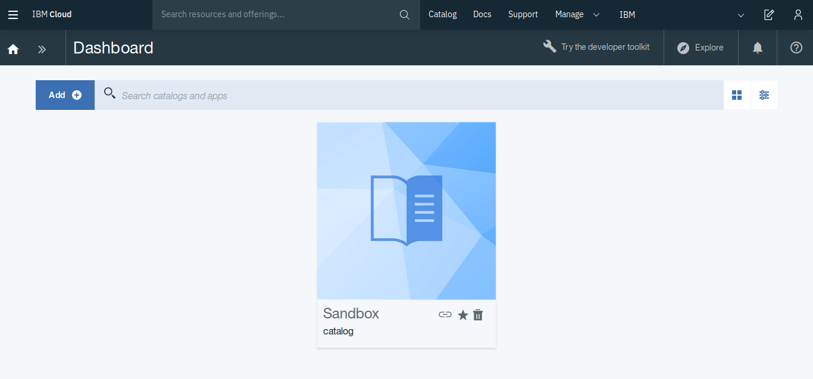
</p>

## Publicar una API

Para poder publicar una API, primero debemos crear un nuevo catálogo. Para esto, desde la vista principal del servicio, hacemos click en el botón **Add** y luego en **Catalog**.

<p align="center">
  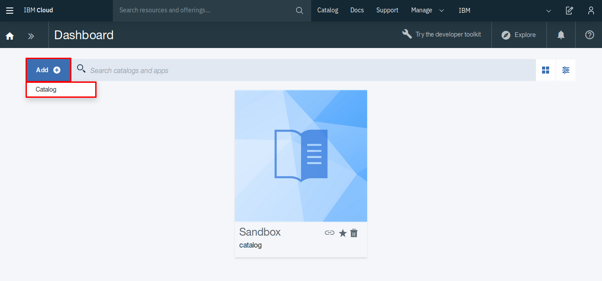
</p>

Le ponemos como nombre _miCatalogo_ y presionamos **Add**.

<p align="center">
  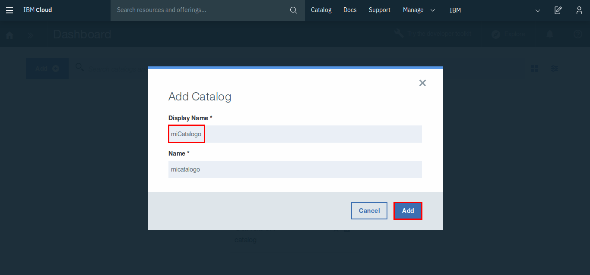
</p>

Ahora que tenemos nuestro catálogo creado, podemos pasar a crear nuestra API. En el menú de la izquierda, seleccionamos la opción **Drafts**.

<p align="center">
  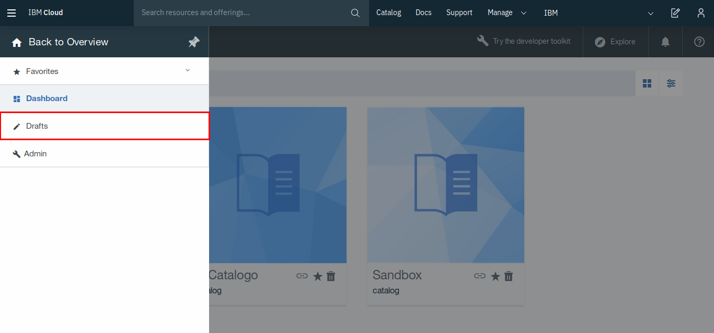
</p>

Ingresamos a la pestaña **APIs** y presionamos **Add**. En las opciones que se abren, seleccionamos **Import API from a file or URL**.

<p align="center">
  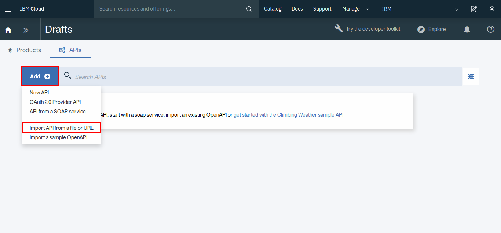
</p>

Presionamos el botón **Select File** y elegimos el archivo _ClimbingWeather-API.yaml_ que se encuentra en la raíz del repositorio. 

<p align="center">
  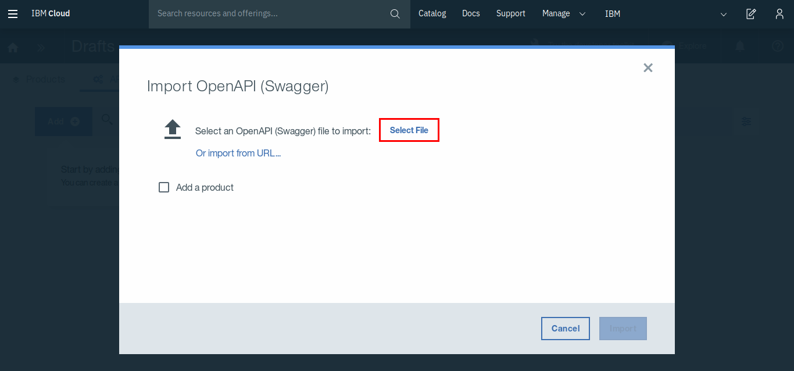
</p>

Luego, marcamos la opción **Add a product** y elegimos un título para el producto que vamos a agregar. En este caso, lo nombraremos _climbingWeather_.

<p align="center">
  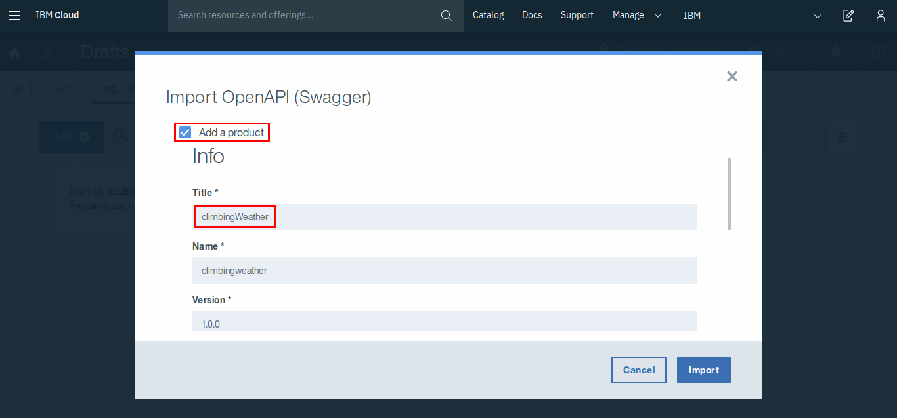
</p>

Por último, selecciomos el catálogo _miCatalogo_, que creamos anteriormente, para publicar nuestro producto. Presionamos el botón **Import** y se importará la API.

<p align="center">
  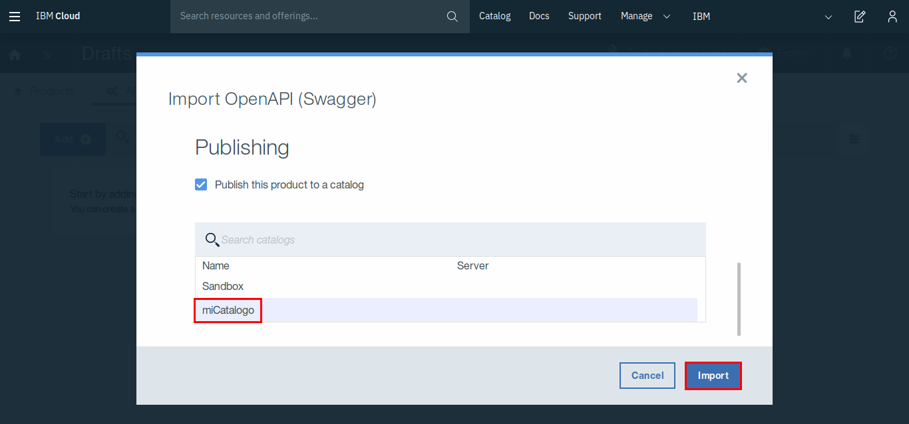
</p>

Se abrirá la vista de diseño de la API que importamos anteriormente. Podremos ver información relevante y configurar características de la API según las necesidades del desarrollador.

<p align="center">
  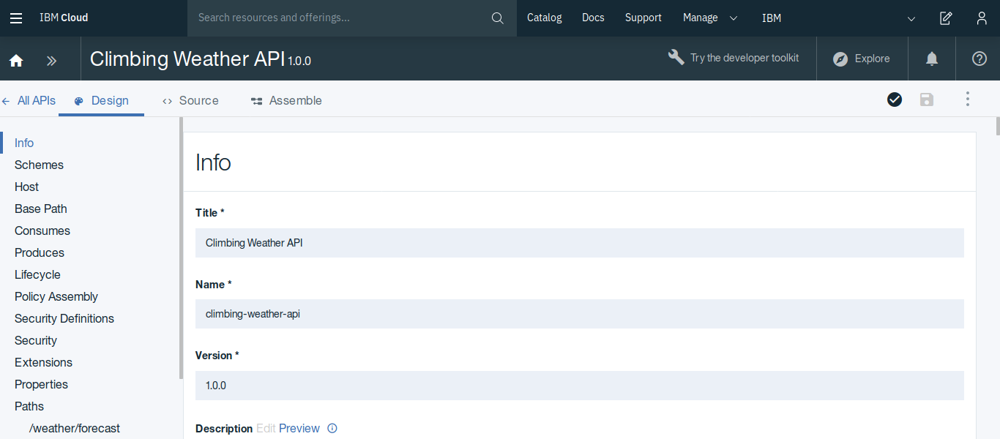
</p> 

En este momento tenemos nuestra API publicada para que pueda ser consumida por una aplicación externa.

## Realizar llamadas a la API publicada

Para testear que nuestra API se encuentra funcionando correctamente utilizaremos la aplicación _Postman_, que nos permitirá realizar llamadas fácilmente. Dentro de la aplicación, seleccionamos el botón que nos permite crear una llamada nueva.

<p align="center">
  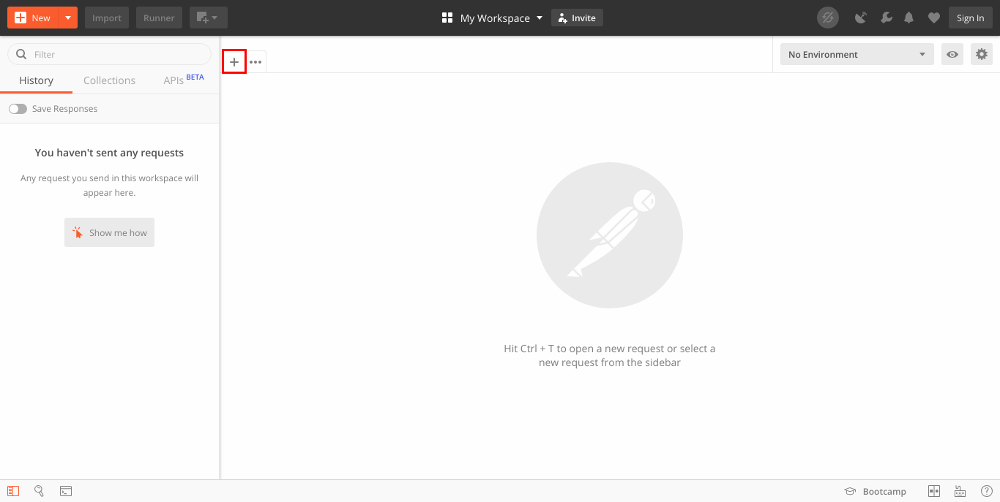
</p>

Para poder preparar nuestra llamada, debemos obtener primero la URL al recurso que queremos consumir. Seleccionamos la pestaña **Explore** y luego el catálogo que creamos en los pasos anteriores.

<p align="center">
  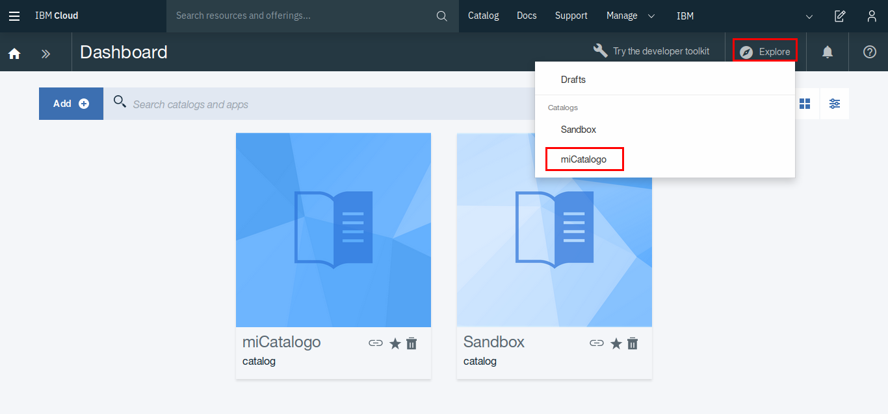
</p>

A continuación, podremos ver información sobre los recursos que se encuentran en nuestro catálogo. Debemos copiar la URL de la API del clima para poder utilizarla en Postman.

<p align="center">
  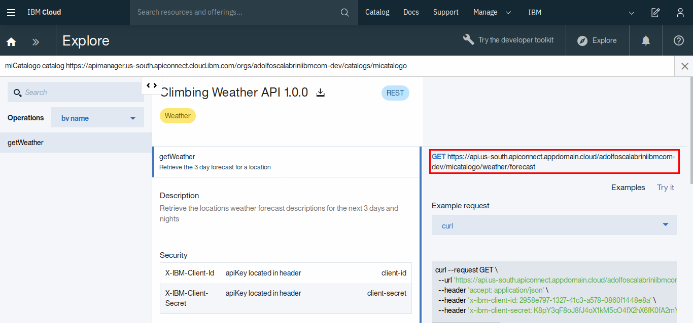
</p>

Con el endpoint copiado, volvemos a _Postman_ y lo pegamos en el área que pide la URL a consultar.

<p align="center">
  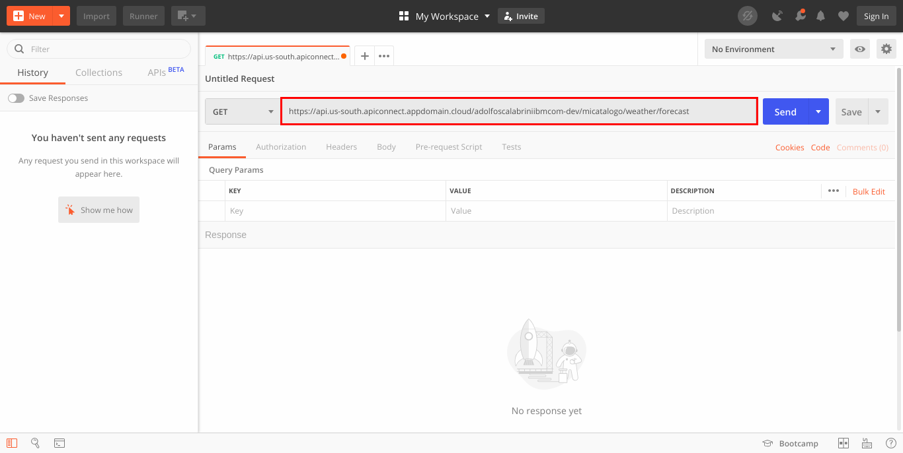
</p>

Ahora debemos definir las claves de seguridad y los parámetros que se van a incluir en la consulta. Para conocer estos parámetros necesarios, volvemos a la vista de la que tomamos el endpoint de la API.\
Luego, vamos a la zona de seguridad y vemos las dos claves que hay que pasarle a la API. Estas claves son:
* X-IBM-Client-Id
* X-IBM-Client-Secret

<p align="center">
  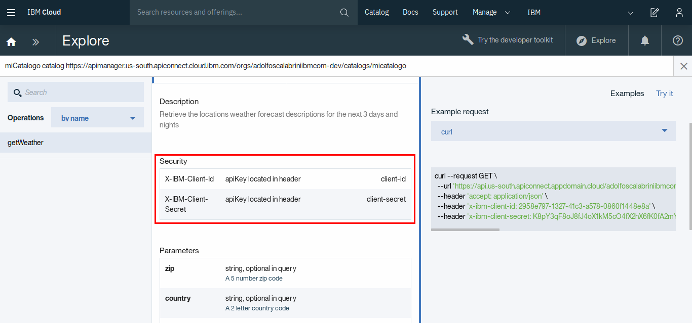
</p>

Para conocer los parámetros necesarios para realizar la consulta bajamos a la zona donde estan definidos los parámetros y vemos que a la API hay que pasarle:
* zip
* country
* lat
* lon

<p align="center">
  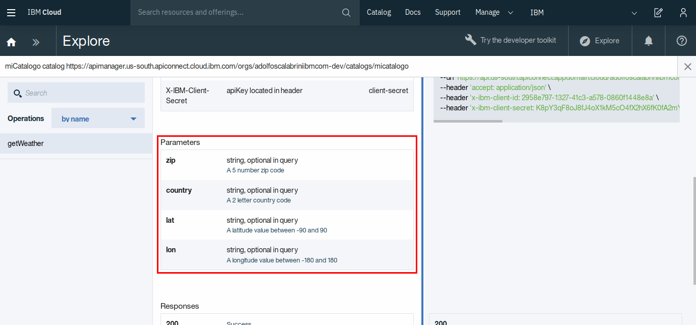
</p>

Ahora que conocemos esos parámetros, hay que retornar a _Postman_ y preparar la consulta a la API. Primero que nada, nos dirigimos a la pestaña **Headers** y agregamos las claves que se encuentran en la siguiente imagen.

<p align="center">
  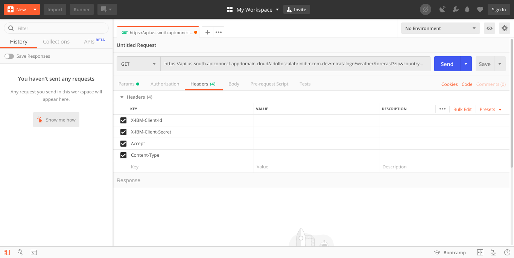
</p>

Los valores de _X-IBM-Client-Id_ y _X-IBM-Client-Secret_ se pueden tomar en la zona que se marca a continuación.

<p align="center">
  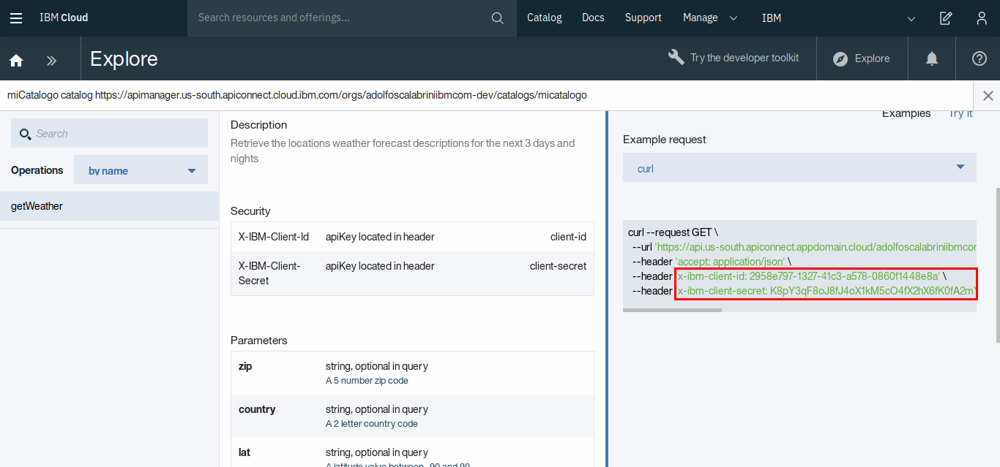
</p>

Una vez que tengamos los valores, los colocamos en la columna _Values_ en _Postman_.

<p align="center">
  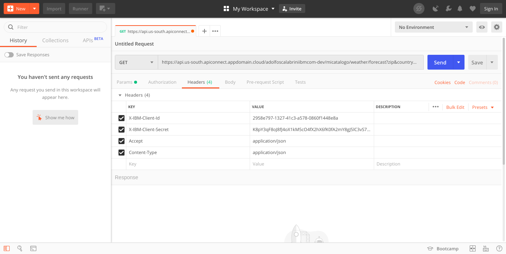
</p>

**Nota**: A las claves _Accept_ y _Content-Type_ se les asigna como valor "application/json".

Vamos a la pestaña **Params**, donde vamos a definir los valores de los parámetros para la consulta. Desmarcamos los parámetros _lat_ y _lon_ y asignamos los siguientes valores:
* zip: 10001
* country: US

Luego, presionamos el botón **Send**:

<p align="center">
  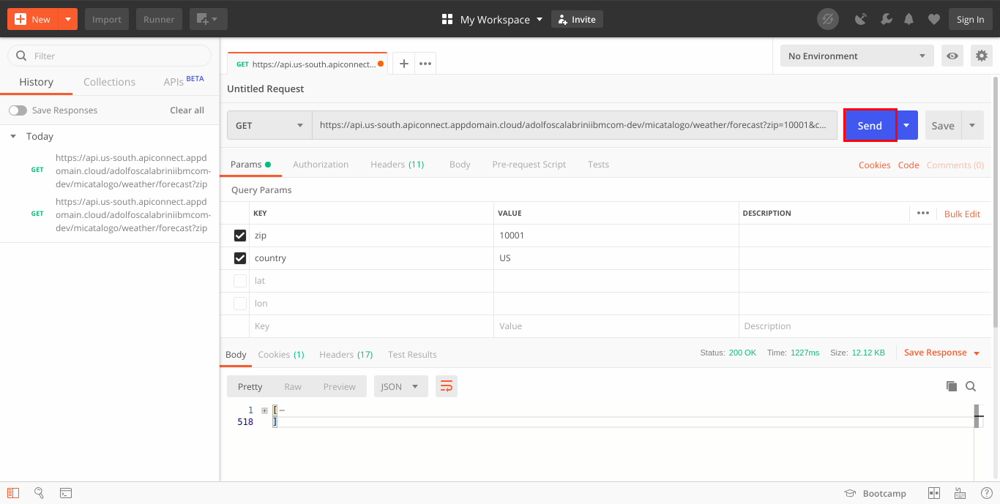
</p>

Esperamos unos segundos para que se realice la consulta y bajamos para ver la respuesta.

<p align="center">
  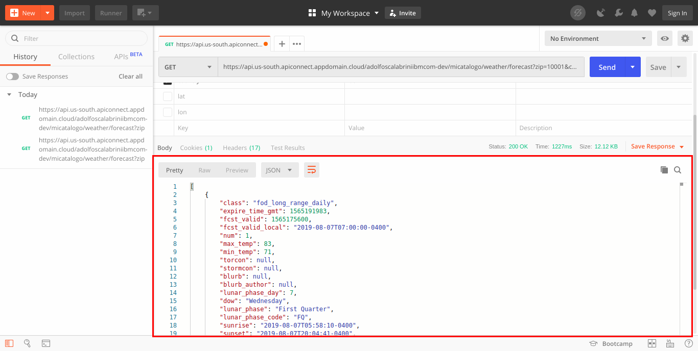
</p>

## Analizar el uso de la API


## Agregar seguridad a la API


## Introducción al Developer Portal


