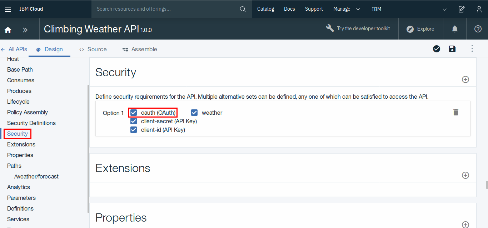

# Workshop sobre API Connect - Aprenda a gestionar el ciclo de vida de sus APIs

<p align="center">
  
</p>

## Flujo
* Crear una instancia del servicio API Connect
* Publicar una API
* Realizar llamadas a la API publicada
* Analizar el uso de la API
* Agregar seguridad a la API
* Introducción al Developer Portal 

## Resumen

IBM API Connect es una solución líder en el mercado de gestión de API que permite la creación automatizada de API, descubrimiento de activos, autoservicio para desarrolladores con administración y seguridad incorporada. Esta herramienta le facilita la labor a los desarrolladores para crear, desplegar, administrar, asegurar y monetizar sus APIs.

## Descripción

En este hands-on aprenderemos a utilizar el servicio API Connect con el que podremos publicar una API, agregándole aspectos de seguridad para que no cualquier persona pueda consumirla. Luego, utilizaremos la API de forma local mediante la aplicación Postman. Una vez que tengamos algunas llamadas realizadas, pasaremos a analizar el uso de la API mediante un panel personalizable. Por último, entenderemos cómo utilizar el Developer Portal y cúales son sus beneficios. 

## ¿Qué tiene el repositorio?
- ClimbingWeather-API.yaml
- Imagenes
- README.md

## Prerrequisitos
* Registrarse en IBM Cloud: [https://ibm.biz/Bd26aa](https://ibm.biz/Bd26aa)
* Instalar Git
  - [Windows](https://gitforwindows.org/)
  - Linux
    ```
    $ sudo apt update 
    $ sudo apt install git
    $ git --version
    ```
  - [MacOS](https://git-scm.com/download/mac)

* Clonar el repositorio
  ```
  $ git clone https://github.com/IBMInnovationLabUY/api-connect-code-day
  ```
* Instalar [Postman](https://www.getpostman.com/downloads/)

## Crear una instancia del servicio API Connect

Para crear la instancia del servicio, entramos a nuestra cuenta de IBM Cloud y seleccionamos la pestaña **Catalog**.

<p align="center">
  
</p>

Presionamos a la opción **Integration** y seleccionamos el servicio **API Connect**.

<p align="center">
  
</p>

Hay que ingresar un nombre para la instancia que vamos a crear. En este caso, ponemos _API Connect-code-day_ y presionamos el botón **Create**.

<p align="center">
  
</p>

Luego, se abre la interfaz del servicio API Connect y podremos comenzar a trabajar en el mismo.

<p align="center">
  
</p>

## Publicar una API

Para poder publicar una API, primero debemos crear un nuevo catálogo. Para esto, desde la vista principal del servicio, hacemos click en el botón **Add** y luego en **Catalog**.

<p align="center">
  
</p>

Le ponemos como nombre _miCatalogo_ y presionamos **Add**.

<p align="center">
  
</p>

Ahora que tenemos nuestro catálogo creado, podemos pasar a crear nuestra API. En el menú de la izquierda, seleccionamos la opción **Drafts**.

<p align="center">
  
</p>

Ingresamos a la pestaña **APIs** y presionamos **Add**. En las opciones que se abren, seleccionamos **Import API from a file or URL**.

<p align="center">
  
</p>

Presionamos el botón **Select File** y elegimos el archivo _ClimbingWeather-API.yaml_ que se encuentra en la raíz del repositorio. 

<p align="center">
  
</p>

Luego, marcamos la opción **Add a product** y elegimos un título para el producto que vamos a agregar. En este caso, lo nombraremos _climbingWeather_.

<p align="center">
  
</p>

Por último, selecciomos el catálogo _miCatalogo_, que creamos anteriormente, para publicar nuestro producto. Presionamos el botón **Import** y se importará la API.

<p align="center">
  
</p>

Se abrirá la vista de diseño de la API que importamos anteriormente. Podremos ver información relevante y configurar características de la API según las necesidades del desarrollador.

<p align="center">
  
</p> 

En este momento tenemos nuestra API publicada para que pueda ser consumida por una aplicación externa.

## Realizar llamadas a la API publicada

Para testear que nuestra API se encuentra funcionando correctamente utilizaremos la aplicación _Postman_, que nos permitirá realizar llamadas fácilmente. Dentro de la aplicación, seleccionamos el botón que nos permite crear una llamada nueva.

<p align="center">
  
</p>

Para poder preparar nuestra llamada, debemos obtener primero la URL al recurso que queremos consumir. Seleccionamos la pestaña **Explore** y luego el catálogo que creamos en los pasos anteriores.

<p align="center">
  
</p>

A continuación, podremos ver información sobre los recursos que se encuentran en nuestro catálogo. Debemos copiar la URL de la API del clima para poder utilizarla en Postman.

<p align="center">
  
</p>

Con el endpoint copiado, volvemos a _Postman_ y lo pegamos en el área que pide la URL a consultar.

<p align="center">
  
</p>

Ahora debemos definir las claves de seguridad y los parámetros que se van a incluir en la consulta. Para conocer estos parámetros necesarios, volvemos a la vista de la que tomamos el endpoint de la API.\
Luego, vamos a la zona de seguridad y vemos las dos claves que hay que pasarle a la API. Estas claves son:
* X-IBM-Client-Id
* X-IBM-Client-Secret

<p align="center">
  
</p>

Para conocer los parámetros necesarios para realizar la consulta bajamos a la zona donde estan definidos los parámetros y vemos que a la API hay que pasarle:
* zip
* country
* lat
* lon

<p align="center">
  
</p>

Ahora que conocemos esos parámetros, hay que retornar a _Postman_ y preparar la consulta a la API. Primero que nada, nos dirigimos a la pestaña **Headers** y agregamos las claves que se encuentran en la siguiente imagen.

<p align="center">
  
</p>

Los valores de _X-IBM-Client-Id_ y _X-IBM-Client-Secret_ se pueden tomar en la zona que se marca a continuación.

<p align="center">
  
</p>

Una vez que tengamos los valores, los colocamos en la columna _Values_ en _Postman_.

<p align="center">
  
</p>

**Nota**: A las claves _Accept_ y _Content-Type_ se les asigna como valor "application/json".

Vamos a la pestaña **Params**, donde vamos a definir los valores de los parámetros para la consulta. Desmarcamos los parámetros _lat_ y _lon_ y asignamos los siguientes valores:
* zip: 10001
* country: US

Luego, presionamos el botón **Send**:

<p align="center">
  
</p>

Esperamos unos segundos para que se realice la consulta y bajamos para ver la respuesta.

<p align="center">
  
</p>

## Agregar seguridad a la API

Ahora veamos cómo proteger el acceso a una API utilizando el protocolo OAuth 2.0. Construiremos el proveedor OAuth 2.0 y luego agregaremos la seguridad OAuth 2.0 a una API existente. En nuestro caso vamos a utilizar la API del clima con la que ya hemos estado trabajando.\
Lo primero que vamos a hacer es copiar nuestro API Endpoint para poder utilizarlo luego. Para encontrarlo hay que ir al dashboard y elegir el catálogo, en mi caso **miCatalogo**.

<p align="center">
  
</p>

Luego hacemos click sobre la pestaña **Settings** y después en la pestaña **Gateways**. Ahí podremos encontrar el endpoint, el cual copiaremos para utilizar más adelante.

<p align="center">
  
</p>

Ahora crearemos la API OAuth 2.0. Vamos a **Drafts** y luego a la pestaña **APIs**.

<p align="center">
  
</p>

Hacemos click sobre **Add** y luego **OAuth 2.0 Provider API**.

<p align="center">
  
</p>

Colocamos de título _OAuth_, nombre oauth y automáticamente debería agregar como base path /oauth. Una vez hayamos completado todos los campos, hacemos clic en **Create API**.

<p align="center">
  
</p>

Se nos abrirá un panel con información de la API que acabamos de crear. Presionamos la opción **OAuth 2** que se encuentra a la izquierda de la pantalla y bajamos hasta la sección **Scopes**. En esta sección, le ponemos como nombre _weather_ al primer scope y borramos los demás.

<p align="center">
  
</p>

Continuamos bajando hasta la sección de **Identity extraction** y en las opciones para _Collect credentials using_ seleccionamos la opción **Basic**.

<p align="center">
  
</p>

En la sección **Authentication**, que se encuentra debajo, pegamos en el campo _Authentication URL_ la siguiente URL:

```
https://httpbin.org/basic-auth/username/password
```

Más tarde utilizaremos las siguientes credenciales para pedir nuestro token para la consumir la API:

* Usuario: username
* Contraseña: password

Ahora hacemos click en el botón para guardar y luego presionamos el botón con los tres puntos. Seleccionamos la opción **Add to existing products**.

<p align="center">
  
</p>

En la ventana que se abre, seleccionamos la API del clima, a la cual le vamos a agregar la API OAuth 2.0, y presionamos el botón **Add**.

<p align="center">
  
</p>

Ahora volvemos a _Drafts_ y entramos a _APIs_ e ingresamos a la API del clima. Luego seleccionamos la sección **Security Definitions**.

<p align="center">
  
</p>

Allí presionamos el botón para agregar una opción y seleccionamos **OAuth**.

<p align="center">
  
</p>

Luego, bajamos hasta el elemento nuevo con nombre _oauth-1_.\
En el campo _Name_ ingresamos **oauth** y en _Flow_ seleccionamos la opción **Password**.\
Por último, en el campo _Token URL_ ingresamos los siguiente con algunos cambios:

```
https://api.us-south.apiconnect.appdomain.cloud/adolfoscalabriniibmcom-dev/micatalogo/oauth/oauth2/token
```

La URL anterior está conformada por su endpoint más /oauth/oauth2/token.

<p align="center">
  
</p>

Bajamos hasta la sección _Scopes_ y agregamos uno con nombre weather.

<p align="center">
  
</p>

Luego seleccionamos la sección **Security** y marcamos la opción **oauth**. 

<p align="center">
  
</p>

Ahora guardamos los cambios presionando el botón que se encuentra en la zona superior derecha.

## Probando OAuth

Ahora que tenemos seguridad en nuestra API, lo que falta es testear que la misma funcione correctamente.\
Lo primero que debemos hacer es consumir la API de OAuth para que nos asigne un token que luego nos permitirá utilizar la API del clima.\
Abrimos un terminal y ejecutamos el siguiente comando. Se debe cambiar la URL a la Token URL que definimos antes y el valor _client_id_ al que habíamos utilizado anteriormente:

```
curl -v -k https://api.us-south.apiconnect.appdomain.cloud/adolfoscalabriniibmcom-dev/micatalogo/oauth/oauth2/token -d "grant_type=password&scope=weather&username=username&password=password&client_id=2958e797-1327-41c3-a578-0860f1448e8a"
```


## Introducción al Developer Portal


